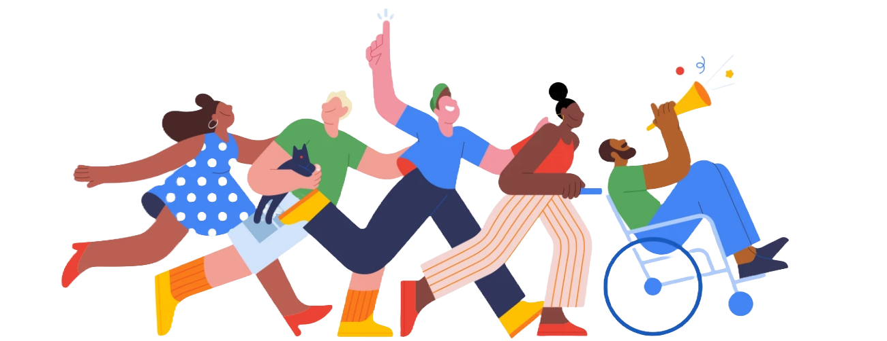
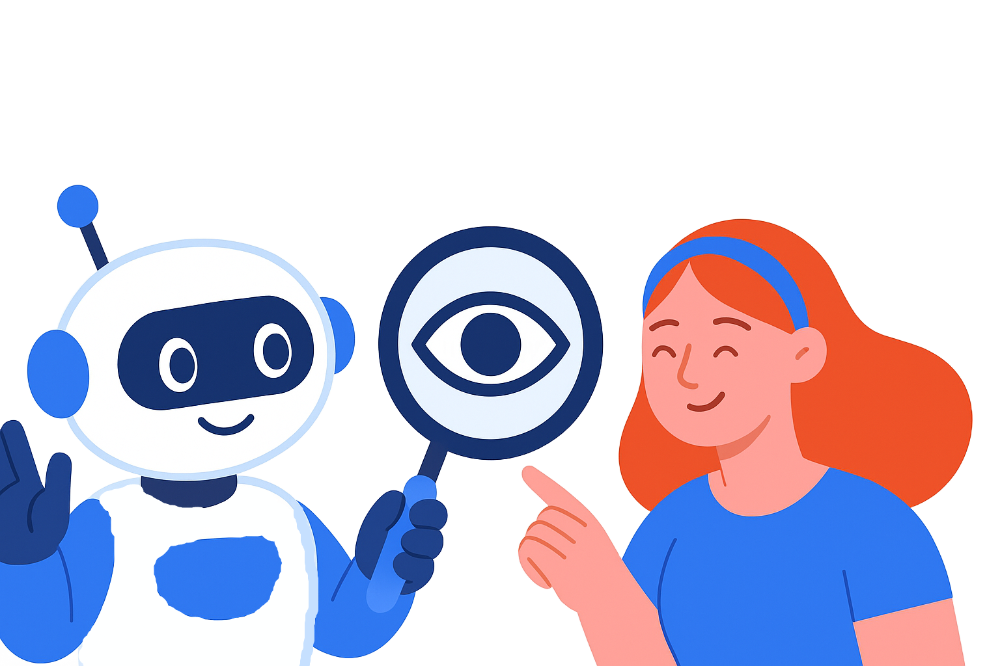
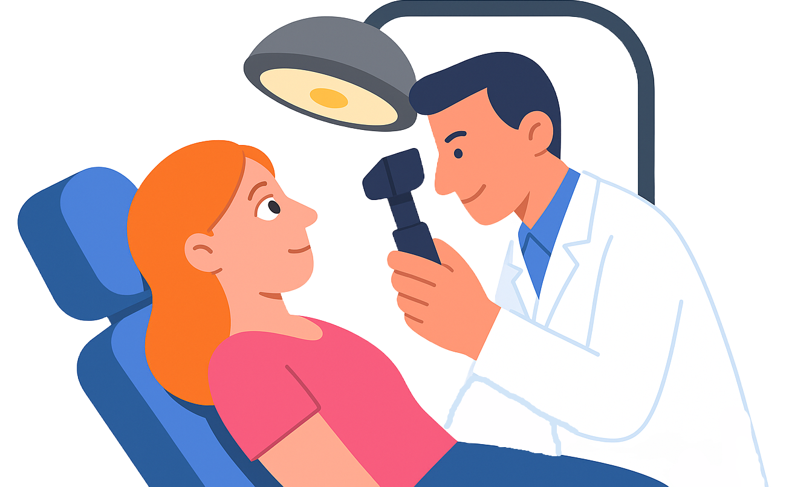

# **BetterSight**: Your Personal Ophthalmology Assistant

Welcome to **BetterSight** – an AI-powered web application that helps users analyze retinal images, chat about eye health, and find nearby eye specialists.  
Empowering you to take charge of your eye health, anytime, anywhere.

---

## 🚀 Features

- **AI Retinal Image Analysis**  
  Upload eye photos and receive instant, AI-driven insights about potential retinal diseases.

- **Conversational Chatbot**  
  Get answers to your eye health questions from a friendly, knowledgeable assistant.

- **Doctor Recommendations**  
  Find trusted ophthalmologists and eye specialists near you, complete with maps and contact details.

- **Secure Google Authentication**  
  Sign in safely with your Google account.

- **Modern, Responsive UI**  
  Enjoy a seamless experience on desktop and mobile devices.

---

## 🗂️ Project Structure

```
client/                # React frontend
  src/
    components/        # React components (Dashboard, LandingPage, etc.)
    assets/            # Images and icons
  public/
retinal_disease_api/   # Python FastAPI backend for AI analysis
  retina_api/
    main.py            # API endpoints
    model.py           # Model loading and inference
    models/            # Pretrained model files (.h5)
server/                # Node.js/Express backend for chat, user, and doctor APIs
```

---

## 🛠️ Getting Started

### 1. Clone the Repository

```sh
git clone https://github.com/yourusername/bettersight.git
cd bettersight
```

### 2. Setup the Frontend

```sh
cd client
npm install
npm run dev
```

### 3. Setup the Node.js Server

```sh
cd ../server
npm install
npm start
```

### 4. Setup the AI Backend

```sh
cd ../retinal_disease_api
pip install -r requirements.txt
uvicorn retina_api.main:app --reload
```

---

## 🖼️ Screenshots

| Dashboard | AI Analysis | Doctor Finder |
|-----------|-------------|---------------|
|  |  |  |

---

## ⚙️ Configuration

- **Frontend:**  
  Edit `client/src/components/Dashboard.jsx` to set your `SERVER_URL`.
- **Backend:**  
  Set environment variables in `server/.env` for API keys and ports.
- **AI Model:**  
  Place your `.h5` model files in `retinal_disease_api/retina_api/models/`.

---

## 🤝 Contributing

Pull requests are welcome! For major changes, please open an issue first to discuss what you would like to change.

---

## 📄 License

This project is licensed under the MIT License.

---

## 🙏 Acknowledgements

- [React](https://react.dev/)
- [FastAPI](https://fastapi.tiangolo.com/)
- [TensorFlow](https://www.tensorflow.org/)
- [Google Firebase](https://firebase.google.com/)
